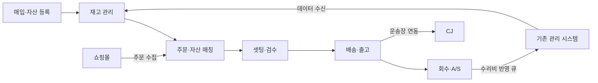
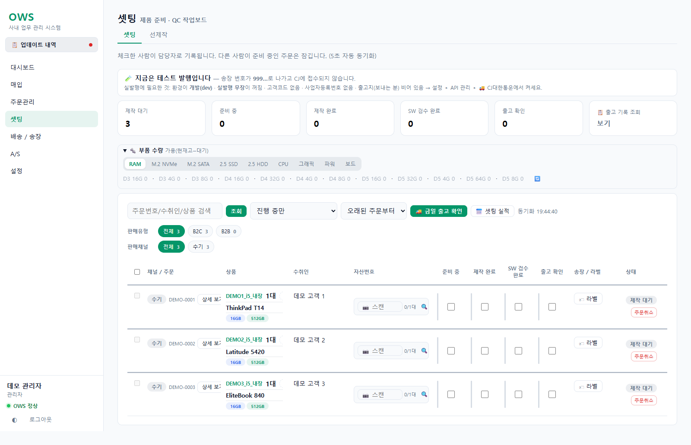
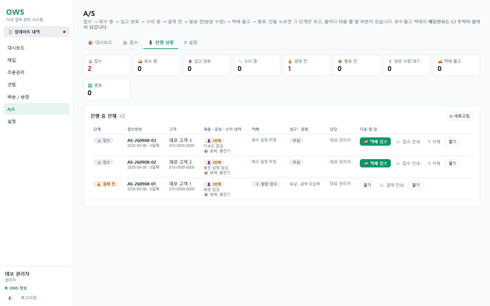

# Operations Workflow System

> GPT와 Claude를 활용해 기획부터 구현·검증·운영까지 단독으로 개발한 사내 업무 자동화 웹 도구


## 프로젝트 소개

중고 PC 유통 업무의 **매입, 재고, 주문, 셋팅·검수, 배송, A/S, 정산**을 연결하는 Flask 기반 웹 도구입니다. 자산번호를 기준으로 제품과 업무 이력을 연결하고, 쇼핑몰 주문 수집과 기존 관리 시스템 연동을 처리합니다.

현업의 요청을 업무 조건과 예외 상황으로 구체화하고, AI 코딩 도구를 활용해 화면·API·DB·테스트·운영 구성을 만들었습니다. 이 저장소는 회사 및 서비스 식별정보를 익명화한 포트폴리오 공개본입니다.

## 담당 역할과 AI 활용

**단독 개발**로 기획, 백엔드, 프론트엔드, 데이터 연동, 테스트, 운영을 담당했습니다. 개발 과정에서 **GPT와 Claude**를 사용했습니다.

| 영역 | 담당 범위 |
| --- | --- |
| 업무 분석·기획 | 업무 흐름 정리, 단계별 처리 조건, 화면 및 권한 설계 |
| 구현 | Flask API, SQLite 스키마, JavaScript 업무 화면 |
| 자동화·연동 | 쇼핑몰 주문, 배송, A/S 알림, 기존 시스템 데이터 연결 |
| 검증 | 업무 상태, 데이터 중복, 권한, 외부 연동 예외 테스트 |
| 운영 | Windows 실행, 워치독, 로그, 백업과 재시작 구성 |

AI 활용 경험은 요구사항을 구체화하고 결과를 확인한 사례로 설명합니다. 모델별 작업 분담이나 실제 프롬프트 원문은 이 문서에 포함하지 않습니다.

## 면접용 데모

로컬 환경을 설치한 Windows PC에서는 `DEMO-START.bat`을 더블클릭하면 가상 데이터가 채워진 데모가 열립니다.

- 관리자: `demo` / `Demo-2026!`
- 제한 계정: `viewer` / `Demo-2026!`
- 처음 상태로 복구: `DEMO-RESET.bat`
- 종료: `DEMO-STOP.bat`

데모는 실행할 때마다 새 임시 DB를 만들고 자동 수집·문자 발송·외부 HTTP 호출을 차단합니다. 시연 순서와 5분 설명 대본은 [면접 시연 가이드](docs/INTERVIEW_GUIDE.md)에 정리했습니다.

## 업무 흐름



## 최근 확장한 기능

2026-09-08 로컬 소스 기준입니다. 외부 연동의 실제 사용에는 별도 계약·설정이 필요합니다.

| 업무 | 추가·확장한 기능 | 코드 |
| --- | --- | --- |
| 매입·재고 | 기준정보, 자산번호 관리, 카테고리 재분류 | [purchase](app/purchase/) |
| 판매·정산 | 판매 전표 입력, 원가 스냅샷, 미수금·마진 관리 | [sale_entry.py](app/purchase/sale_entry.py) |
| 기존 시스템 연동 | 증분 수신, 수리비 전송 큐, 실패·충돌 상태 관리 | [tms_link.py](app/purchase/tms_link.py), [tms_push.py](app/purchase/tms_push.py) |
| A/S | 유상 미결제 출고 제한, 회수 구성품 입력·추가, 문자 반영 | [asvc](app/asvc/), [notify](app/notify/) |
| 배송 | 운송장 도구, 배송 일정, 쇼핑몰 송장 전송 보완 | [cj](app/cj/), [invoice_push.py](app/malls/invoice_push.py) |
| 작업 관리 | 셋팅·검수, 담당자 작업량·실적 화면 확장 | [prep](app/prep/), [reports](app/reports/) |

## 문제 해결 사례

### 1. 금액 미입력 상태의 유상 A/S 출고 방지

무상에서 유상으로 변경했지만 청구 금액을 입력하지 않으면, 미수금 0원을 결제 불필요 상태로 해석할 수 있었습니다.

유상 여부와 결제 확인 기록으로 `payment_pending()`을 판단하고, 청구액 계산은 별도로 처리했습니다. 같은 판단을 작업 보드와 반송·종료 제어에 사용해, 금액 미입력이 결제 단계를 건너뛰는 이유가 되지 않도록 했습니다.

**업무 요청을 명확한 상태 규칙으로 바꾸고 여러 실행 경로에 적용한 사례입니다.**

[구현](app/asvc/__init__.py) · [송장 발급 제어](app/orders/waybill.py) · [테스트](tests/test_phase456.py)

### 2. 양방향 연동의 수리비 중복 합산 방지

내부에서 입력한 수리비를 외부 시스템에 보낸 뒤 다시 받아오면, 같은 비용이 새로운 비용으로 인식될 수 있습니다.

변경을 전송 큐에 기록하고 대기·반영·실패·충돌 상태를 관리합니다. 이미 전송한 금액과 비용 출처를 구분해, 다시 수신한 데이터가 원가에 중복 반영되는 경로를 제어합니다.

**자동화를 연결한 이후 발생하는 재처리와 데이터 일관성까지 고려한 사례입니다.**

[전송 큐](app/purchase/tms_push.py) · [원가 동기화](app/purchase/migration.py) · [테스트](tests/test_asset_costs.py)

### 3. 쇼핑몰별 응답 차이와 호출 제한 대응

쇼핑몰별 어댑터에서 주문을 공통 형태로 변환합니다. 프로세스 공통 토큰 캐시와 HTTP 429 이후 호출 대기 처리를 두어, 수집이 반복되어도 인증과 호출 제한 상태를 유지합니다.

**외부 서비스별 차이를 분리하고 공통 업무 처리를 재사용한 사례입니다.**

[공통 어댑터](app/malls/base.py) · [주문 수집](app/malls/collect.py) · [테스트](tests/test_call_budget.py)

## 주요 화면

아래 이미지는 공개본을 가상 데이터로 실행한 화면입니다. 실제 고객·주문·운영 실적을 나타내지 않습니다.

### 주문 관리


### 매입·자산 관리


### 셋팅·검수



### 배송·송장


### A/S


금액을 아직 입력하지 않은 유상 수리 완료 건도 결제 전 단계에서 관리합니다.



### 설정


### 매출·실적


## 기술과 운영

| 영역 | 구성 |
| --- | --- |
| Backend | Python, Flask, Blueprint |
| Database | SQLite WAL, 명시적 쓰기 트랜잭션, 스키마 마이그레이션 |
| Frontend | HTML, CSS, Vanilla JavaScript |
| Integration | Requests, 쇼핑몰 어댑터, CJ, 외부 데이터 창구 |
| Runtime | Waitress, Windows 실행 스크립트, 워치독 |
| Quality | unittest, 업무별 회귀 테스트 |

전역 API 인증 게이트와 기능별 권한 검사, 감사로그, 트랜잭션 롤백, SQLite 온라인 백업 API를 사용합니다. 단일 프로세스로 운영하는 사내 도구 구조입니다.

## 실행

```bat
python -m venv .venv
.venv\Scripts\python.exe -m pip install -r requirements.txt
set OWS_HOST=127.0.0.1
set OWS_NO_TRACKER=1
set OWS_NO_TMS_SYNC=1
.venv\Scripts\python.exe run.py
```

`http://localhost:5100`에서 최초 관리자 계정을 만듭니다. 위 명령은 포트폴리오 확인용으로 자동 수집과 동기화를 끕니다. 운영 DB, 계정, 외부 API 인증정보는 포함하지 않습니다.

환경변수 접두사는 `OWS_`이며, 별도 DB는 `OWS_DB`, 포트는 `OWS_PORT`로 지정합니다. Windows 관리 스크립트는 `OWS-SETUP.bat`, `OWS-START.bat`, `OWS-STATUS.bat`, `OWS-STOP.bat`입니다. 해당 스크립트는 `venv` 폴더를 사용하므로 스크립트 실행 시 `OWS-SETUP.bat`부터 시작합니다.

## 검증

```bat
set OWS_DB=%TEMP%\ows-tests\test.db
set OWS_NO_TRACKER=1
set OWS_NO_FILE_LOG=1
.venv\Scripts\python.exe -m unittest discover -s tests -v
```

최신 실행 결과와 알려진 한계는 [검증 기록](docs/VALIDATION.md)에 정리합니다. 테스트 개수를 커버리지 또는 업무 개선율로 환산하지 않습니다.

화면 재생성은 [캡처 스크립트](scripts/capture_real_ui.py)를 사용합니다. 별도로 Playwright 패키지와 Microsoft Edge가 필요하며, 임시 DB에서 데모 데이터를 생성합니다.

```bat
.venv\Scripts\python.exe -m pip install playwright
.venv\Scripts\python.exe scripts\capture_real_ui.py
```

## 공개 범위

회사·서비스 식별정보는 중립적인 명칭으로 바꾸고, 계약번호·연락처·주소 기본값은 예시 값으로 대체했습니다. 운영 DB, 고객 파일, 로그, 백업, 인증정보, 내부 인수인계서는 최신 코드 반영 대상에서 제외했습니다.

출고 확인 시 판매 전표 자동 생성은 향후 개선 대상으로, 이번에 완료한 기능에 포함하지 않습니다. 업무 시간 절감률과 실제 이용자 수는 측정 근거가 없어 기재하지 않았습니다.
