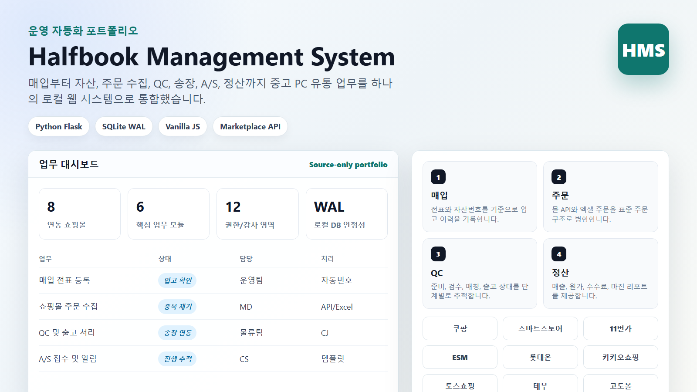
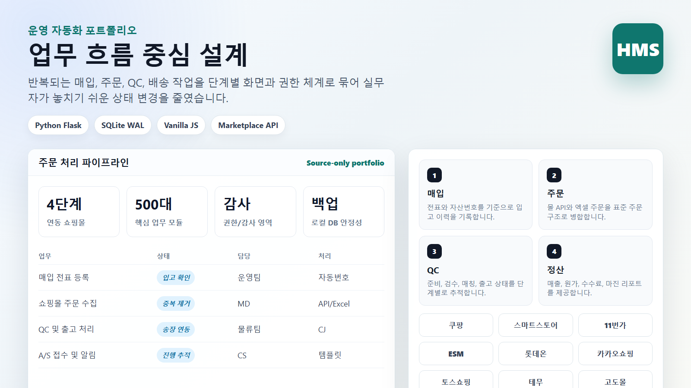
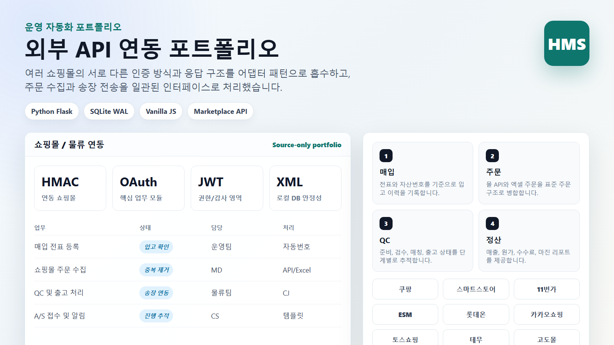

# Halfbook Management System



중고 노트북/PC 유통 업무를 위한 **사내 운영 관리 시스템**입니다. 매입, 자산 관리, 주문 수집, QC, 송장 발급, A/S, 정산 리포트를 하나의 Flask 기반 웹 애플리케이션으로 통합했습니다.

## 프로젝트 개요

| 항목 | 내용 |
|---|---|
| 프로젝트 | Halfbook Management System |
| 역할 | 기획, 업무 흐름 설계, 백엔드/프론트엔드 구현, 데이터 이관, API 연동 |
| 기술 | Python, Flask, SQLite WAL, Vanilla JavaScript, HTML/CSS, Waitress |
| 목적 | 반복적인 중고 PC 유통 운영 업무를 한 화면에서 처리하고 추적 |
| 배포 환경 | Windows 기반 로컬/LAN 사내 운영 환경 |

## 핵심 기능



- **매입/자산 관리**: 전표, 자산번호, 분류, 등급, 재고 구분, 수리 이력 관리
- **주문 관리**: 엑셀 주문 가져오기, 쇼핑몰 API 주문 수집, 중복 주문 제거
- **QC/출고 흐름**: 준비, 검수, 자산 매칭, 송장 발급, 출고 확정 단계 추적
- **배송 연동**: CJ대한통운 송장 발급, 운송장 PDF, 배송 추적
- **A/S 관리**: 접수, 회수 예약, 수리 진행, 고객 안내 템플릿
- **리포트**: 매출, 원가, 수수료, 마진, 직원별 작업량, 재고 통계
- **관리자 기능**: 계정, 권한, 담당 분류, API 키 마스킹, 감사 로그

## 외부 연동



쇼핑몰마다 인증 방식과 응답 구조가 달라서 어댑터 방식으로 분리했습니다.

- 쿠팡
- 스마트스토어
- 11번가
- ESM
- 롯데온
- 카카오쇼핑
- 토스쇼핑
- 테무
- 고도몰
- CJ대한통운

## 구조

```text
app/              Flask API와 업무 모듈
  auth/           로그인, 세션, 권한
  purchase/       매입, 자산, 재고, 데이터 이관
  orders/         주문, QC, 자산 매칭, 송장 처리
  malls/          쇼핑몰 API 어댑터와 자동 수집
  cj/             CJ대한통운 연동과 운송장 PDF
  settings/       관리자 설정, QC 이관/감시 도구
  reports/        운영 리포트
static/           Vanilla JS 기반 단일 페이지 화면
tests/            업무 흐름 회귀 테스트
scripts/          유지보수/마이그레이션 스크립트
```

## 보안 및 공개 범위

이 저장소는 포트폴리오 공개용으로 정리한 **소스 전용 버전**입니다.

포함하지 않은 항목:

- 실제 운영 DB
- 고객/주문 엑셀 파일
- 백업 파일
- 로그 파일
- 가상환경
- `.env` 및 API 키

업로드 전 점검 기준은 [GitHub upload checklist](docs/GITHUB_UPLOAD_CHECKLIST.md)에 정리했습니다.

## 실행 방법

```bat
python -m venv venv
venv\Scripts\pip install -r requirements.txt
venv\Scripts\python.exe run.py
```

접속 주소:

```text
http://localhost:5100
```

테스트:

```bat
venv\Scripts\python.exe -m unittest discover -s tests -v
```

## 구현 포인트

- 실무자가 쓰는 단계 중심 화면으로 업무 누락을 줄이도록 설계
- SQLite WAL과 트랜잭션 기반으로 로컬 운영 안정성 확보
- API 키와 민감 설정값은 화면 응답에서 마스킹
- 권한별 메뉴/기능 접근 제어
- 쇼핑몰별 인증/주문 구조 차이를 어댑터로 분리
- 백업, 감사 로그, watchdog 프로세스로 운영 복구성 강화
