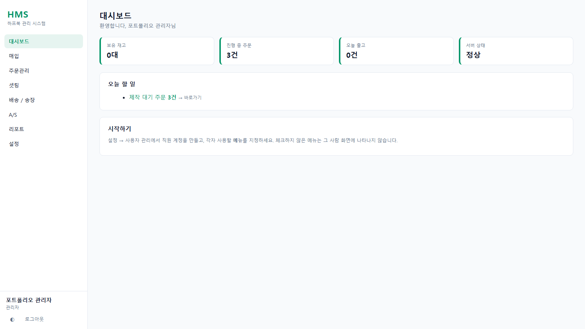
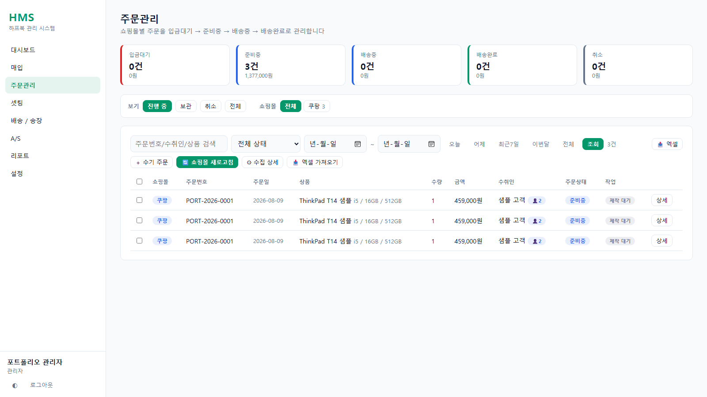
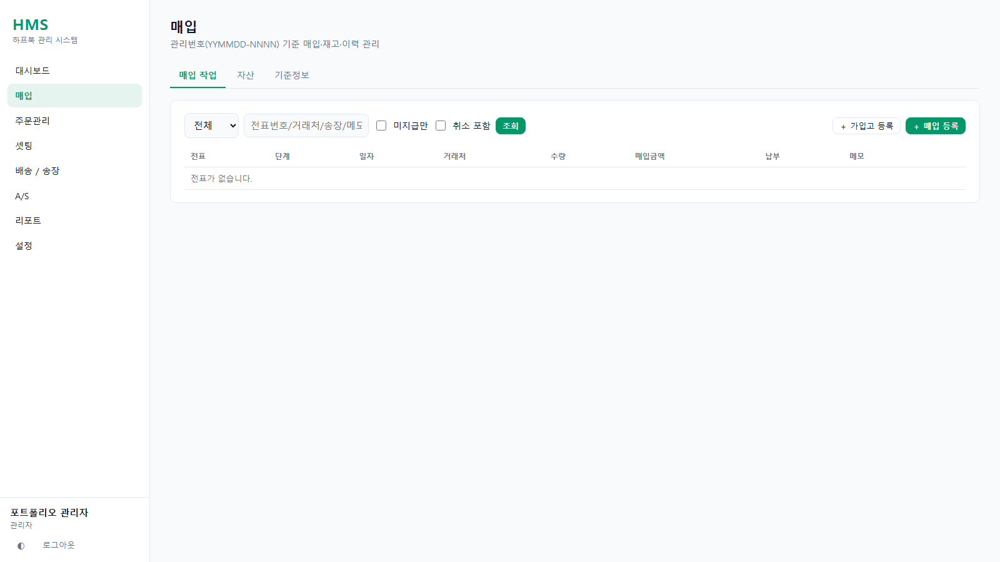
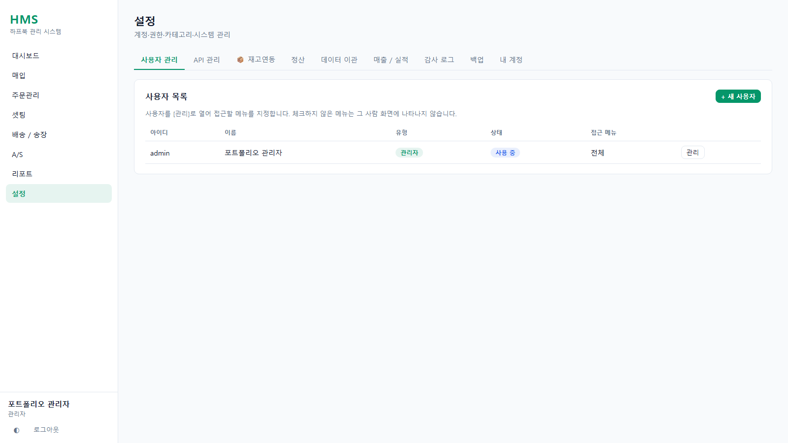
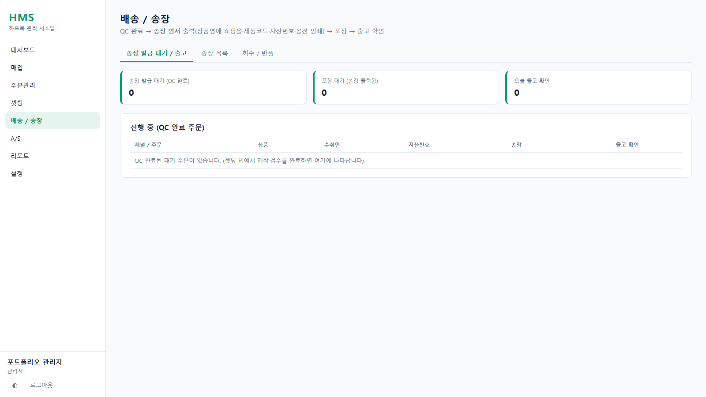
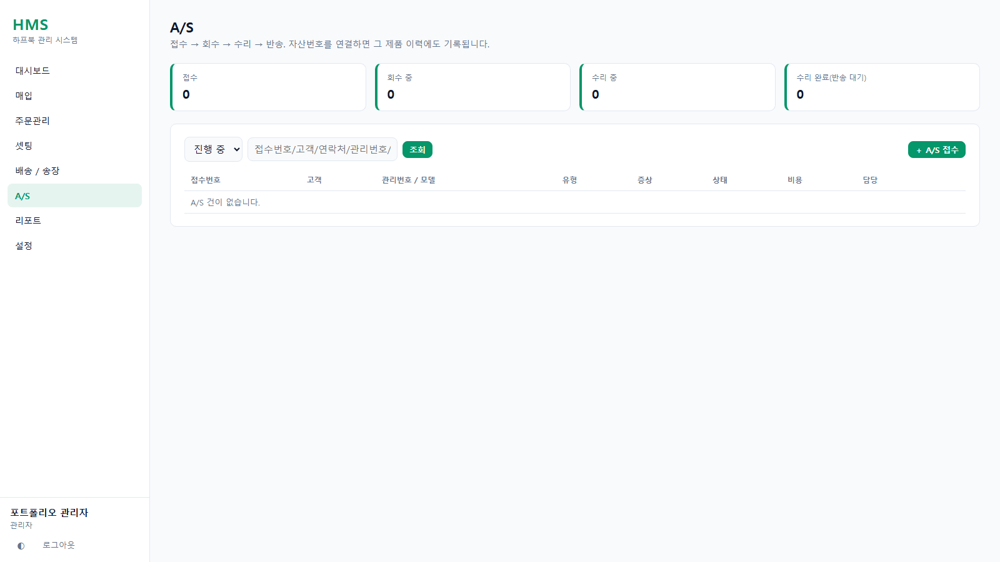
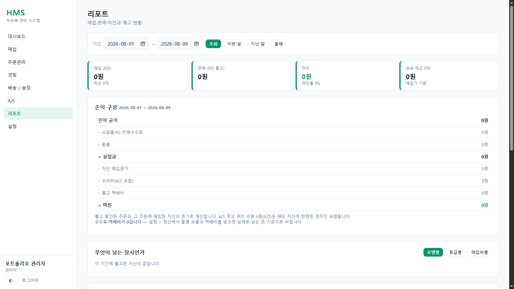

# Halfbook Management System

> 중고 PC 유통사의 반복 운영 업무를 하나의 흐름으로 묶은 사내 업무 관리 시스템



## 한 줄 소개

Halfbook Management System은 중고 노트북/PC 유통 과정에서 발생하는 **매입, 자산 관리, 주문 수집, QC, 송장 발급, A/S, 정산** 업무를 통합한 Flask 기반 사내 운영 시스템입니다.

기존에는 엑셀, 쇼핑몰 관리자, 택배 시스템, 별도 QC 프로그램에 흩어져 있던 업무를 한 화면에서 추적할 수 있도록 설계했습니다.

## 담당 역할

| 구분 | 내용 |
|---|---|
| 기획 | 실제 운영 흐름 분석, 화면 구조 설계, 권한 체계 정의 |
| 백엔드 | Flask API, SQLite 스키마, 트랜잭션 처리, 백업/감사 로그 구현 |
| 프론트엔드 | Vanilla JS 기반 단일 페이지 업무 화면 구현 |
| 연동 | 쇼핑몰 주문 수집, CJ대한통운 송장, SMS/알림 구조 설계 |
| 데이터 | 기존 주문/QC/TMS 데이터 이관 및 중복 처리 로직 구현 |
| 운영 | Windows 로컬/LAN 실행, watchdog, 자동 백업 흐름 구성 |

## 사용 기술



| 영역 | 기술 |
|---|---|
| Backend | Python, Flask |
| Database | SQLite WAL, schema migration, transactional writes |
| Frontend | HTML, CSS, Vanilla JavaScript |
| Runtime | Waitress, Windows batch scripts |
| Integration | Requests, marketplace APIs, CJ Logistics API |
| Test | Python unittest |

## 해결한 문제

### 1. 주문과 재고 상태가 여러 시스템에 흩어지는 문제

쇼핑몰 주문, 수기 주문, QC 상태, 송장 발급 상태가 서로 다른 화면에 흩어져 있으면 출고 누락과 중복 처리가 발생하기 쉽습니다.

이 프로젝트에서는 주문을 `입금대기 → 준비중 → 배송중 → 배송완료` 흐름으로 정리하고, 자산 매칭과 송장 상태를 같은 화면에서 확인할 수 있게 만들었습니다.

### 2. 쇼핑몰별 API 구조가 모두 다른 문제

쿠팡, 스마트스토어, 11번가, ESM, 롯데온, 카카오쇼핑, 토스쇼핑, 테무, 고도몰은 인증 방식과 응답 구조가 다릅니다.

이를 몰별 어댑터로 분리해 내부 주문 구조는 동일하게 유지했습니다. 덕분에 새 쇼핑몰을 추가해도 주문 처리 화면과 중복 제거 로직은 그대로 재사용할 수 있습니다.

### 3. 운영 DB를 안전하게 유지해야 하는 문제

로컬 사내 시스템은 작은 장애도 업무 중단으로 이어질 수 있습니다.

SQLite WAL, 트랜잭션, 주기 백업, 종료 백업, 감사 로그, watchdog 프로세스를 적용해 운영 안정성을 높였습니다.

## 주요 화면

### 대시보드


재고, 진행 중 주문, 오늘 출고, 서버 상태를 요약합니다. 운영자가 오늘 처리해야 할 업무를 빠르게 확인할 수 있도록 구성했습니다.

### 주문관리


쇼핑몰별 주문을 수집하고, 상태별로 필터링하며, 준비/QC/배송 흐름을 관리합니다. 엑셀 가져오기와 쇼핑몰 새로고침 기능을 함께 제공합니다.

### 매입 관리



전표, 거래처, 자산, 기준정보를 분리해 관리합니다. 중고 PC의 입고부터 판매 가능 상태까지 이어지는 재고 흐름을 추적합니다.

### 관리자 설정



사용자 권한, API 키, 재고연동, 정산, 데이터 이관, 감사 로그, 백업을 관리합니다. 직원별로 접근 가능한 메뉴와 기능을 제한할 수 있습니다.

### 배송 / 송장



QC가 끝난 주문을 송장 발급 대기, 포장 대기, 출고 확인 단계로 나누어 관리합니다. CJ대한통운 송장 발급과 운송장 출력 흐름을 이 화면에서 처리하도록 설계했습니다.

### A/S



접수, 회수, 수리, 반송 단계를 따로 추적합니다. 자산번호와 연결하면 해당 제품의 이력에도 A/S 기록이 남도록 구성했습니다.

### 리포트



매입, 판매, 마진, 재고 현황을 기간 기준으로 확인합니다. 판매 금액, 수수료, 환불, 원가, 수리비, 택배비를 분리해 손익을 추적할 수 있게 했습니다.

## 핵심 기능

- 매입 전표 및 자산번호 관리
- 자산 등급, 분류, 재고 상태, 수리 이력 관리
- 쇼핑몰 주문 API 수집
- 엑셀 주문 가져오기
- 주문 중복 제거 및 상태 병합
- QC 단계별 작업 체크
- CJ대한통운 송장 발급 및 PDF 출력
- A/S 접수, 회수, 반송, 고객 알림
- 매출, 원가, 수수료, 마진 리포트
- 사용자 권한, 감사 로그, 백업 관리

## 기술적으로 신경 쓴 부분

### 권한 설계

관리자와 직원 권한을 분리하고, 메뉴 접근과 기능 실행 권한을 따로 관리했습니다. 사용자가 보지 않아야 할 메뉴는 화면에서 숨기고, API에서도 다시 검증합니다.

### 데이터 무결성

주문과 자산 매칭, 출고 취소, 회수 입고처럼 상태가 여러 테이블에 걸치는 작업은 트랜잭션으로 처리했습니다. 일부만 저장되어 데이터가 꼬이는 상황을 막는 데 집중했습니다.

### 민감 정보 처리

API 키, 토큰, 비밀번호성 필드는 화면 응답에서 마스킹하고, 기존 키를 유지한 채 일부 설정만 수정할 수 있게 했습니다.

### 실제 운영 환경 대응

Windows PC에서 바로 실행할 수 있도록 batch 파일과 watchdog 서버를 구성했습니다. 서버가 종료되거나 PC가 재시작되어도 다시 띄울 수 있는 구조를 고려했습니다.

## 포트폴리오 포인트

- 단순 CRUD가 아니라 실제 사내 운영 흐름을 기준으로 설계한 업무 시스템입니다.
- 프레임워크를 크게 늘리지 않고 Flask와 Vanilla JS로 유지보수 가능한 구조를 만들었습니다.
- 운영 데이터 보호를 위해 GitHub 공개용 소스와 실제 DB/백업/엑셀 파일을 분리했습니다.
- 테스트 DB에서 앱을 직접 실행해 README 화면 캡처를 생성했습니다.
- 화면, API, DB, 외부 연동, 운영 스크립트까지 한 프로젝트 안에서 구현했습니다.

## 프로젝트 구조

```text
app/
  auth/           로그인, 세션, 권한
  purchase/       매입, 자산, 재고, 데이터 이관
  orders/         주문, QC, 자산 매칭, 송장 처리
  malls/          쇼핑몰 API 어댑터와 자동 수집
  cj/             CJ대한통운 연동과 운송장 PDF
  settings/       관리자 설정, QC 이관/감시 도구
  reports/        운영 리포트
static/           Vanilla JS 단일 페이지 화면
tests/            업무 흐름 회귀 테스트
scripts/          유지보수/캡처/마이그레이션 스크립트
```

## 실행 방법

```bat
python -m venv venv
venv\Scripts\pip install -r requirements.txt
venv\Scripts\python.exe run.py
```

접속 주소:

```text
http://localhost:5100
```

테스트:

```bat
venv\Scripts\python.exe -m unittest discover -s tests -v
```

## 공개 범위

이 저장소는 포트폴리오 공개용으로 정리한 소스 버전입니다.

포함하지 않은 항목:

- 실제 운영 DB
- 고객/주문 엑셀 파일
- 백업 파일
- 로그 파일
- 가상환경
- `.env` 및 API 키

## 검증

- Python 3.12 가상환경에서 의존성 설치 확인
- `/api/health` 스모크 테스트 통과
- 테스트 DB로 실제 앱 실행 후 화면 캡처 생성
- 전체 테스트는 3분 제한까지 다수 통과했으나 완료 전 타임아웃
